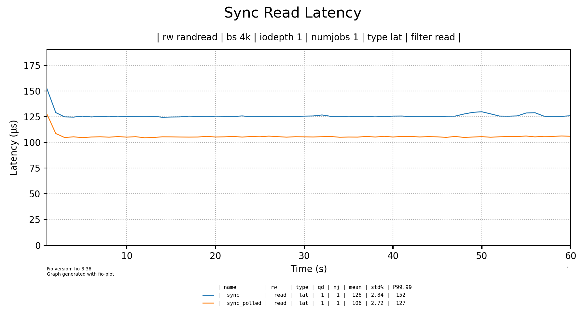
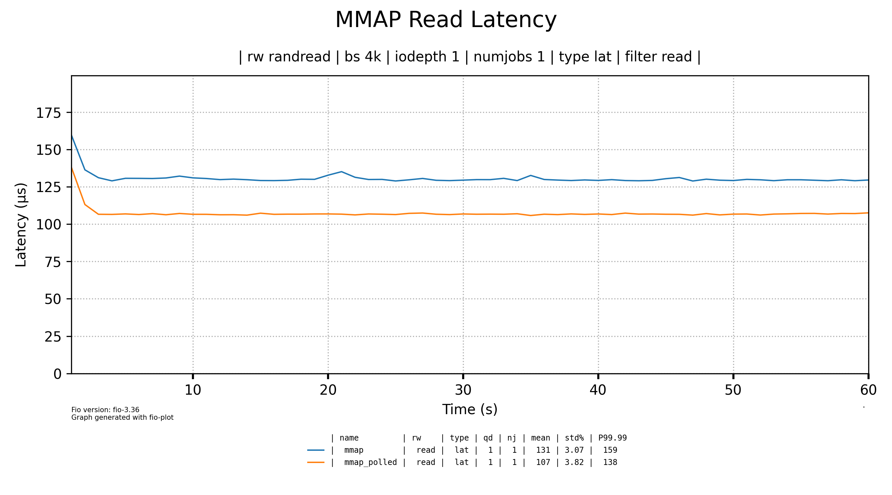
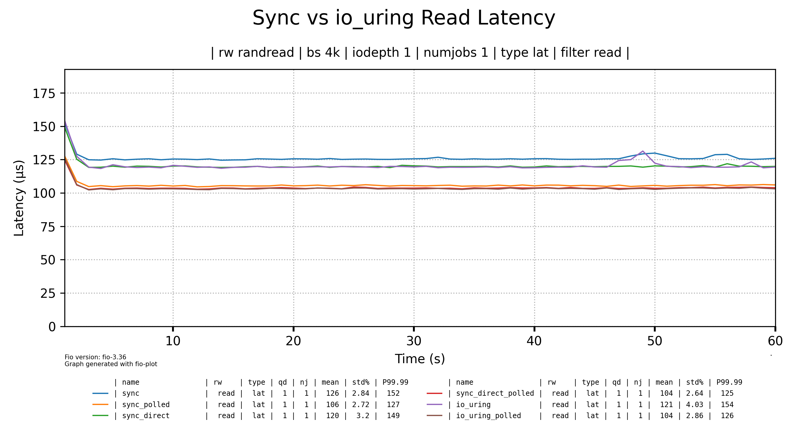
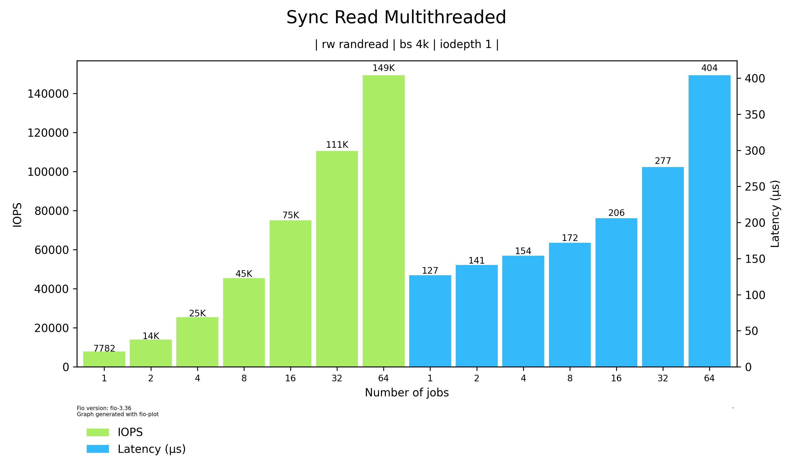
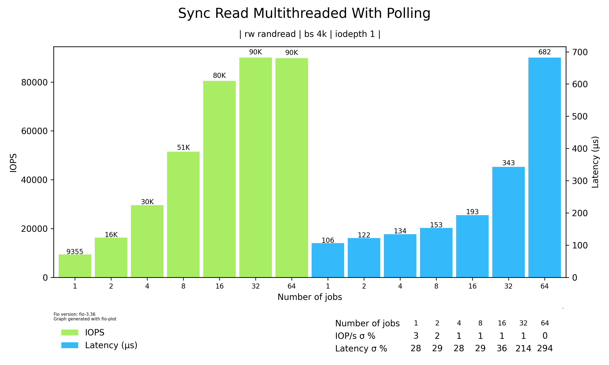

# force-iopoll.ko
This is a Linux kernel module to force polled I/O path on NVMe SSDs.\
Polled I/O path allows to reduce read latency on modern low-latency SSDs. Speedup is achived by getting rid of OS context switch and interrupt handling overhead, but with cost of high CPU utilization. 

Currently, polled I/O path in Linux is only accessible via io_uring without page cache (with `O_DIRECT` flag). Synchronous direct polled I/O path was [removed](https://patchwork.kernel.org/project/linux-mm/patch/20220420143110.2679002-1-ming.lei@redhat.com/#24824449) since kernel 5.19.

This module enables polled I/O path for every NVMe SSD read for given process. It intercepts `submit_bio` call on the block layer and injects `REQ_POLLED` flag, later polling for bio completion with `bio_poll`.

**Note:** module is not thoroughly tested, so stable work is not guaranteed.

### Add poll queues to NVMe driver

In order for polling to work, you should set nvme.poll_queues driver parameter before the disks are attached. You can do it by inserting `nvme.poll_queues=n` to kernel command line, where `n` is the number of queues you want. 

### Configuration
Module is configured through `/dev/force_iopoll` ioctl. There is a `force_iopoll_ctl` user-space utility for convenient configuration. Current configuration can be viewed in `/proc/force_iopoll`
```
$ force_iopoll_ctl --help
Usage: force_iopoll_ctl add <pid> [OPTIONS]
       force_iopoll_ctl remove <pid> [OPTIONS]
       force_iopoll_ctl enable-global [OPTIONS]
       force_iopoll_ctl disable-global [OPTIONS]

Commands:
  add <pid>             enable iopoll for process
  remove <pid>          disable iopoll for process
  enable-global         enable iopoll for all processes in system
  disable-global        disable global iopoll

Options (for 'add' command):
  -f, --follow-forks    iopoll will be inherited by forked processes
  -y, --hybrid          sleep before polling to reduce CPU usage

Options (for 'enable-global' command):
  -y, --hybrid          sleep before polling to reduce CPU usage

Options (for all commands):
  -d, --device PATH     use custom device path (default: /dev/force_iopoll)
  -h, --help            show this help message

```

#### Enable polling on system boot
To enable polling in every process on system boot, add force_iopoll to auto-loaded modules with `iopoll_global` set to true:
```
echo force_iopoll | sudo tee /etc/modules-load.d/force_iopoll.conf
echo iopoll_global=true | sudo tee /etc/modprobe.d/force_iopoll.conf
```
**WARNING**: It is highly experimental and succsessful boot is not guaranteed. 

### Benchmark results
Tested on HUAWEI Matebook 14s HKFG-X, i7-13700H, 16Gb RAM.\
Fio random read of 160Gb file on SSD, sync read latency reduction - near 16%.


Image below compares in-kernel io_uring polling with sync polling enabled by module.



